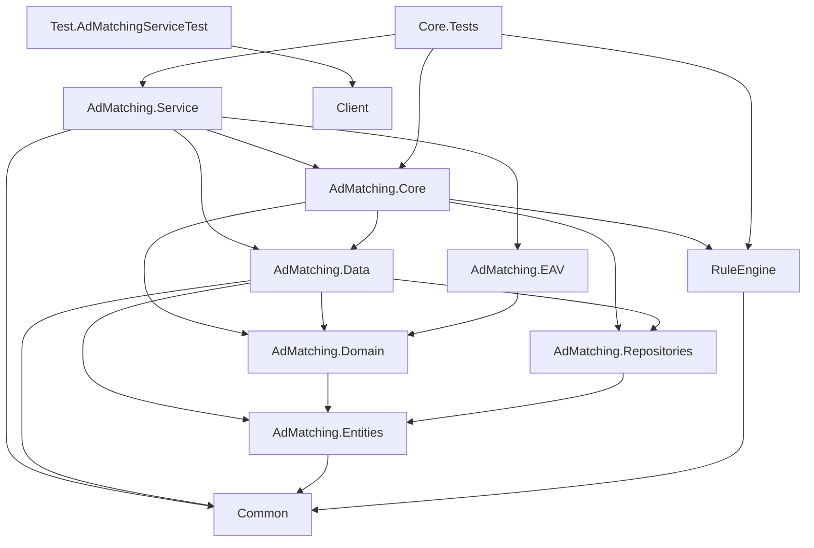
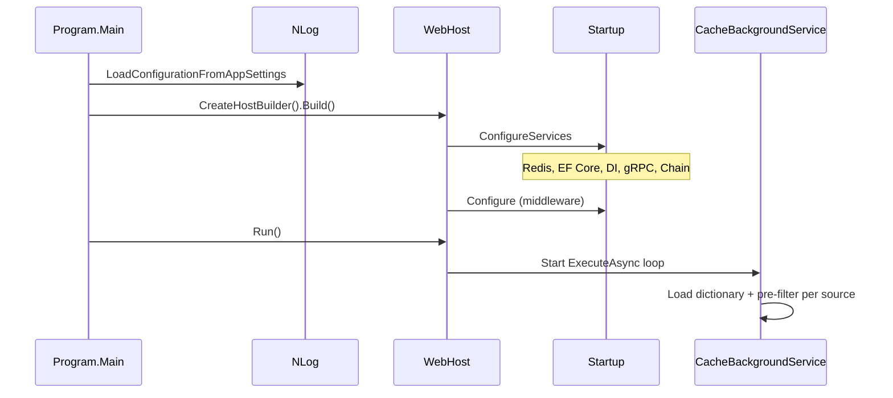

# 2. Solution Overview & 3. Architecture

## Solution Projects

| # | Project | Type | Purpose |
|---|---------|------|---------|
| 1 | EDDY.IS.AdMatching.Service | ASP.NET Core Web (net6.0) | gRPC host, DI composition root, background cache service |
| 2 | EDDY.IS.AdMatching.Core | Class Library | Handler chain, engines, cache service, evaluators |
| 3 | EDDY.IS.AdMatching.Domain | Class Library | Orchestration, DTOs, domain interfaces, business entities |
| 4 | EDDY.IS.AdMatching.Data | Class Library | EF Core context, repositories, CommonDataManager |
| 5 | EDDY.IS.AdMatching.Entities | Class Library | POCO entities and database views |
| 6 | EDDY.IS.AdMatching.Repositories | Class Library | Repository interfaces |
| 7 | EDDY.IS.AdMatching.EAV | Class Library | Matching Engine WCF client, Eddy listing adapter |
| 8 | EDDY.IS.RuleEngine | Class Library | QueryBuilder-style rule evaluation |
| 9 | EDDY.IS.Common | Class Library | Shared DTOs, enums, settings classes |
| 10 | EDDY.IS.AdMatching.Caching | Class Library (stub) | Empty placeholder — not referenced |
| 11 | EDDY.IS.AdMatching.Core.Tests | Test (MSTest) | Handler and rule engine unit tests |
| 12 | EDDY.IS.Test.AdMatchingServiceTest | Test (NUnit) | Service integration tests |
| 13 | Client (EDDY.IS.Examples.ClientNet) | ASP.NET MVC 5 (.NET 4.6.1) | gRPC-Web sample client |
| 14 | Client/Client.csproj | Legacy | Alternate client project file |

**Note:** `EDDY.IS.AdMatching.Caching` exists in filesystem but is **not** in `EDDY.IS.AdMatching.sln`.

## Project Reference Dependency Graph

### Reference Matrix

| Project | References |
|---------|------------|
| Service | Core, Data, EAV, Common |
| Core | Data, Domain, Repositories, RuleEngine |
| Data | Domain, Entities, Repositories, Common |
| Domain | Entities |
| EAV | Domain |
| Entities | Common |
| Repositories | Entities |
| RuleEngine | Common |

## Startup Sequence

**Evidence:** `Program.cs:12-53`, `Startup.cs:39-112`, `CacheBackgroundService.cs:31-59`.

### Application Lifecycle (Request Scope)

1. gRPC request arrives at `AdsService`
2. Scoped services resolved: `IAdMatchingService`, `IEngine`, `IChainHandler<>`, `IDataManager`, handlers
3. `AdMatchingService` loads cache via scoped `CommonEngine`
4. Handler chain mutates scoped `AdMatchingModel`
5. Response mapped to protobuf and returned
6. Scope disposed at end of request

## Architecture Style

### Primary: **Layered Architecture + Chain of Responsibility**

| Layer | Projects | Responsibility |
|-------|----------|----------------|
| Presentation | Service, Client | gRPC endpoints, proto mapping |
| Application | Domain | Orchestration (`AdMatchingService`), DTOs |
| Domain Logic | Core | Handlers, engines, rule evaluation, caching |
| Infrastructure | Data, EAV | EF Core, WCF client |
| Cross-cutting | Common, RuleEngine | Shared types, rule operators |

### Secondary Patterns

- **Repository + Unit of Work Factory** — `CommonUnitOfWorkRepositoryFactory`
- **Options Pattern** — `IOptions<RedisSettings>`, etc.
- **Strategy** — Rule engine operators per field/operator type
- **Adapter** — EAV wraps WCF Matching Engine

### Why Built This Way (Inferred, Medium Confidence)

The solution appears to be a **refactor of a legacy monolith** ("ams-refactor" Redis prefix in `appsettings.json:20`). Evidence:

- Database-first EF scaffold (`GlassPanelContext` partial, ~1900 lines fluent config)
- Excluded legacy `RulesEvaluator`, `DataManager` in Core
- WCF Connected Service for Matching Engine
- Chain of Responsibility decomposes a formerly monolithic filter pipeline

Pre-computation + caching suggests **latency was a primary driver** — moving filtering to background refresh rather than per-request DB queries.

### Architectural Violations

| Violation | Detail | Severity |
|-----------|--------|----------|
| Core depends on Data | Domain logic layer references infrastructure | Medium |
| Domain depends on Entities | Domain models use EF entities (`VwAdsAm`) | Medium |
| Service is composition root + hosts tests packages | NUnit/Test SDK in web project csproj | Low |
| No bounded contexts | GlassPanel entities include reporting, permissions unused by AMS | Low |
| Singleton RuleEngine + scoped handlers | Generally OK (stateless engine) | None |

## 12. Dependency Injection

### Registration Summary (`Startup.cs:39-92`)

| Lifetime | Type | Implementation |
|----------|------|----------------|
| Singleton | `IConnectionMultiplexer` | StackExchange.Redis |
| Singleton | `ICacheService` | `CacheService` |
| Singleton | `DebugLogger` | — |
| Singleton | `PerformanceLogger` | — |
| Singleton | `IRuleEngine` | `RuleEngine` |
| Scoped | `ICommonUnitOfWorkRepositoryFactory` | `CommonUnitOfWorkRepositoryFactory` |
| Scoped | `IDataManager` | `CommonDataManager` |
| Scoped | `IEngine` | `CommonEngine` |
| Scoped | `IAdMatchingService` | `AdMatchingService` |
| Scoped | `IEddyAdsListingService` | `EddyAdsListingService` |
| Scoped | `IMatchingEngineService` | `MatchingServiceClient` |
| Scoped | `IChainHandler<AdMatchingModel>` | First handler (`StaticAdHandler`) |
| Scoped | Each chain handler | Concrete handler types |
| Hosted | `CacheBackgroundService` | BackgroundService |

### Framework-Provided (Implicit)

| Service | Lifetime |
|---------|----------|
| `IMemoryCache` | Singleton |
| `IDistributedCache` | Singleton |
| `GlassPanelContext` | Scoped |
| `GrpcExceptionInterceptor` | Per-call resolution |

### Factories

- `CommonUnitOfWorkRepositoryFactory` — lazy repository creation sharing one `DbContext` per scope

## 13. Configuration

### appsettings.json Sections

| Section | Bound Type | Used By |
|---------|------------|---------|
| `Logging` | ASP.NET Core | Framework |
| `AllowedHosts` | `"*"` | Framework |
| `Kestrel:EndpointDefaults:Protocols` | `Http1AndHttp2` | Kestrel |
| `Redis` | `RedisSettings` | CacheService, CacheBackgroundService |
| `ConnectionStrings:GlassPanelConnection` | string | EF Core |
| `ConnectionStrings:EddyLogging` | string | NLog database target |
| `LoggingPerformance:EnabledTrueFalse` | bool | PerformanceLogger |
| `MatchingEngineService:Endpoint` | `MatchingEngineServiceSettings` | WCF client |
| `EAVSetting` | `EAVSettings` | EddyAdsListingService URL/logo templates |

### Missing from appsettings (configured but absent)

- `LoggingDebugInformation` — bound in Startup, no JSON section
- `BaseUrlSubstitutions` — bound in Startup, no JSON section
- `NLog` section — falls back to `nlog.config`

### Environment Variables

| Variable | Source |
|----------|--------|
| `ASPNETCORE_ENVIRONMENT` | launchSettings profiles |
| `ASPNETCORE_DETAILEDERRORS` | Dryrun/Production profiles |
| User Secrets ID | `Service.csproj:12` — `14bd8161-32ed-476c-9941-17d54c0b90a2` |

### Secrets (Security Concern)

Redis password and SQL connection strings are in committed `appsettings.json`. Should use User Secrets / Azure Key Vault / environment variables in production.

## 14. Authentication & Authorization

**None implemented.**

- No `AddAuthentication`, `AddAuthorization`, JWT, cookies, or policies
- `Microsoft.AspNetCore.Authentication.Certificate` referenced but unused
- gRPC endpoints are publicly accessible at network level

**Confidence:** High — verified `Startup.cs` entire file.

## 15. Background Processing

| Component | Schedule | Action |
|-----------|----------|--------|
| `CacheBackgroundService` | Every `Redis:ComputeIntervalSeconds` (default 60s) | Reload `DictionaryContainer`, `LoadSharedContainer`, `FilterDictionaryContainer` per source |

No Hangfire, Quartz, Azure Functions, or message queues found.

## 17. Logging

| Mechanism | Target | Level |
|-----------|--------|-------|
| NLog `consoleTarget` | Console | Warn+ |
| NLog `database` | `EddyLogging.dbo.Exception` | Error+ |
| NLog Performance (conditional) | `PerformanceLoggingMasterAMS`, `PerformanceLoggingDetailAMS` | Info/Fatal |
| `ILogger<T>` | Via NLog bridge | Trace minimum in Program |
| New Relic | `[Trace]`, `[Transaction]` | APM |

### Correlation

- `SearchGuid` passed through ad matching requests for performance logging
- No explicit correlation ID middleware

## 18. Exception Handling

| Layer | Behavior |
|-------|----------|
| `AdsService` | try/catch → error message in response, log via ILogger |
| `GrpcExceptionInterceptor` | Catches exceptions, logs, **returns null** (problematic) |
| `CacheBackgroundService` | catch/log, continues loop |
| `CacheService` | catch/log, returns true for NeedsReCompute on error |
| Development | `UseDeveloperExceptionPage` |

No global exception middleware for gRPC beyond interceptor.

## 16. Integrations Summary

See [Services/ServiceCatalog.md](./Services/ServiceCatalog.md) and [Projects/EDDY.IS.AdMatching.EAV.md](./Projects/EDDY.IS.AdMatching.EAV.md).

## Folder-Level Organization (Cross-Project)

| Folder | Pattern | Projects |
|--------|---------|----------|
| `RequestHandler/` | Chain of Responsibility | Core |
| `Engines/` | Evaluator/Builder | Core |
| `ChainResponsability/` | Chain DI wiring | Core, Domain (interfaces) |
| `Repositories/` | Repository | Data, Repositories (interfaces) |
| `Context/` | DbContext | Data |
| `Connected Services/` | WCF proxy | EAV |
| `Dto/RuleEngine/` | DTO | Common |
| `CustomRuleEngine/Operators/` | Strategy | RuleEngine |
