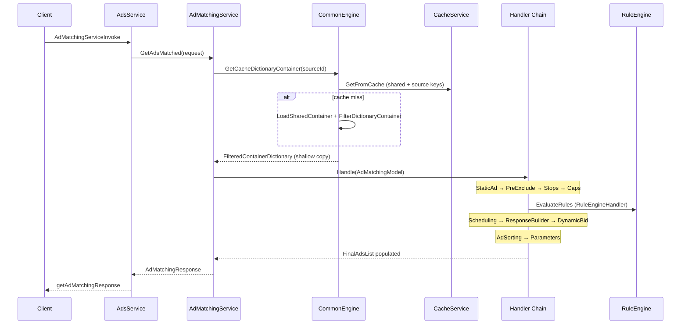
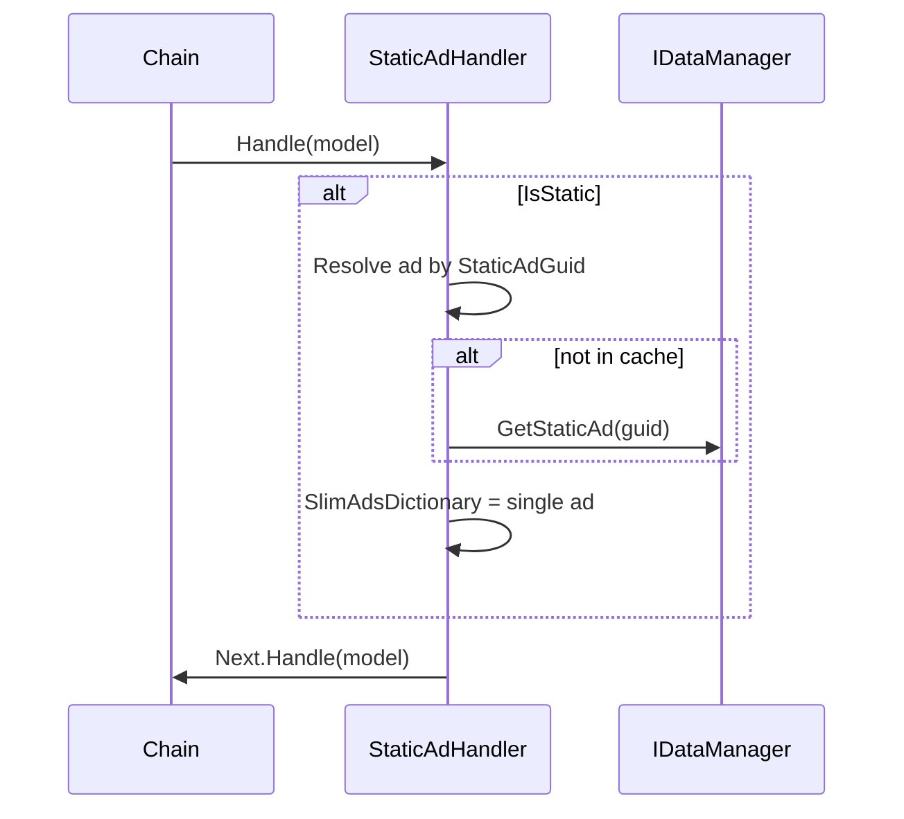
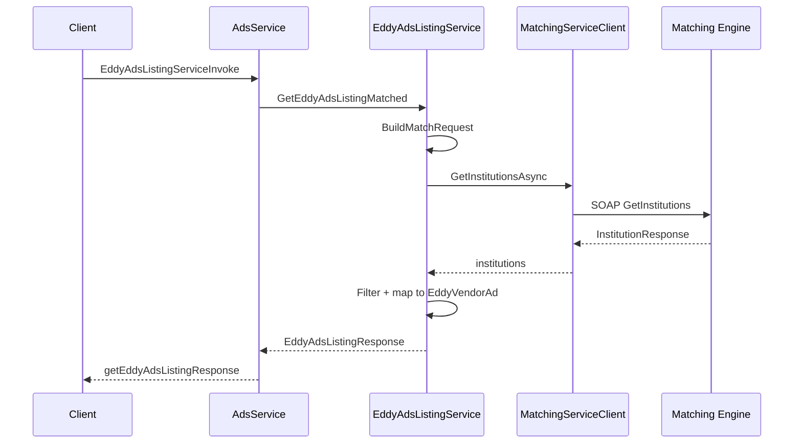
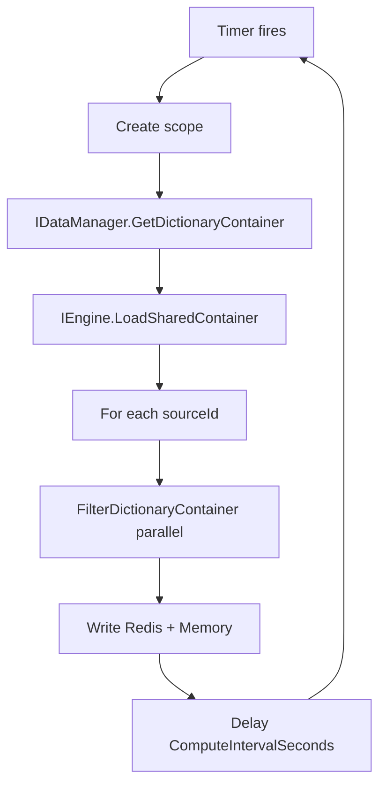

# 7. Business Logic Documentation

## Overview

AMS implements **real-time programmatic ad selection** for education lead generation. Business logic is split between:

1. **Pre-computation** (`CommonEngine`, `CacheBackgroundService`) — source filtering, rule inheritance, relationship resolution
2. **Request pipeline** (10 handler chain steps) — per-request evaluation against visitor parameters
3. **EAV path** (`EddyAdsListingService`) — separate institution matching via WCF

---

## Process 1: Standard Ad Matching

### Purpose

Return up to `MaxAds` ranked, URL-substituted ads for a publisher source and visitor context.

### Inputs

| Input | Source | Validation |
|-------|--------|------------|
| `SourceId` | gRPC request | Must exist in pre-warmed cache |
| `Parameters` | gRPC map | Passed to rule engine as string dictionary |
| `MaxAds` | gRPC request | Used by AdSortingHandler |
| `SearchGuid` | gRPC request | Logging only |
| `StaticAdGuid` | Optional | If valid GUID → static path |
| `PreExcludeInstitutions` | Optional list | Institution alias exclusion |

**Evidence:** `AdMatchingRequest` (`Domain/Dto/AdMatchingRequest.cs:3-11`), `CreateModel` (`AdMatchingService.cs:58-76`).

### Outputs

| Output | Condition |
|--------|-----------|
| `AdsMatched` list | Success with ads |
| `AdsReturned` count | Always set |
| `Message` | "Success!", empty-set messages, or error |

**Evidence:** `AdMatchingResponse` (`Domain/Dto/AdMatchingResponse.cs:7-11`).

### Business Rules (Handler Chain)

See [Services/HandlerChain.md](./Services/HandlerChain.md) for full detail.

### Edge Cases

| Case | Behavior |
|------|----------|
| No slim ads, not static | Early return: "No ads were matched with the supplied request parameters" |
| All filtered out | "No ads were matched after the filtering of accounts and campaings" |
| Static ad paused | `IDataManager.GetStaticAd` fallback (StaticAdHandler) |
| Missing cache | Reload from DB via CommonEngine |
| Rule field missing | `AcceptMissingKey` operator may pass click |

### Failure Handling

- Handler exceptions propagate to `AdsService` catch block
- Error message includes exception text (information disclosure risk)
- Performance log written in `finally`

### Related Classes

`AdMatchingService`, `CommonEngine`, all handlers, `IRuleEngine`, `CacheService`, `CommonDataManager`

### Related Database Tables/Views

`VW_SlimAdsAMS`, `VW_AdsAMS`, `VW_CampaignAMS`, `CampaignSource`, `TargetingRule`, `CampaignSchedule`, `CampaignStop`, `ClientAdAccountStop`, `ClientAdAccount`

### Sequence Diagram

---

## Process 2: Static Ad Matching

### Purpose

Serve a specific ad by GUID (e.g., contractual single-ad placement).

### Inputs

Valid `StaticAdGuid` in request → `IsStatic = true` in model.

### Rules

1. `StaticAdHandler` loads ad from cache or `GetStaticAd`
2. Narrows `SlimAdsDictionary` to single ad
3. Subsequent handlers still run but on reduced set

**Evidence:** `StaticAdHandler` (Core/RequestHandler/), `CreateModel` GUID parse.

### Sequence Diagram

---

## Process 3: Institution Pre-Exclusion

### Purpose

Allow publishers to exclude specific institution aliases from results (competitive separation).

### Inputs

`PreExcludeInstitutions` list on request.

### Rules

`PreExcludeHandler` removes client ad accounts whose `InstitutionAlias` matches any entry, and removes their ads from `SlimAdsDictionary`.

---

## Process 4: Stop Window Evaluation

### Purpose

Pause ad delivery during configured stop periods (account or campaign level).

### Inputs

Current UTC time, stop records with timezone, `BeginStop`/`EndStop`.

### Rules

- Account stops evaluated first via `StopsEvaluator`
- Campaign stops remove campaigns from `MainDictionaryEvaluated.CampaignsList`
- Timezone conversion via `CommonTimeZoneManager`

**Related tables:** `CampaignStop`, `ClientAdAccountStop`, `TimeZone`, `StateTimeZone`

---

## Process 5: Campaign Cap Enforcement

### Purpose

Remove campaigns that have hit budget/click caps.

### Rules

- `CapsHandler` uses `CapsEvaluator`
- Parent campaign cap inheritance via `CampaignRelationship`

**Related:** `Campaign.IsCapped`, `ClientAdAccountBudget`

---

## Process 6: Targeting Rule Evaluation

### Purpose

Filter ads/campaigns based on visitor parameters vs JSON QueryBuilder rules.

### Inputs

- `model.Parameters` — visitor context key/value pairs
- `TargetingRule.RuleAsQueryBuilderFilterRule` — parsed at load time

### Rules

- Ad-group rules: failure removes ads in that ad group
- Campaign rules (non-dynamic-bid): failure removes ads and campaign
- Dynamic bid rules: evaluated later in `DynamicBidVariablesHandler`
- AND/OR tree evaluation with short-circuit

**Evidence:** `RuleEngineHandler.cs:50-92`, `RuleEngine.cs:9-61`

### Example Parameter Keys (from IdOrField enum)

Age, State, AreaOfStudy, Referrer, SiteUrl, Zip, Channel, DeviceType, etc. (`EDDY.IS.Common/ConstantsAndEnums/IdOrField.cs`)

---

## Process 7: Schedule-Based Bid Boost

### Purpose

Apply schedule-specific bid adjustments or disable ads outside active windows.

### Rules

- `SchedulingHandler` + `ScheduleEvaluator`
- If schedule has `DisableAds=1` and not active → remove campaign
- If active → record schedule for CPC boost in sorting

**Related:** `CampaignSchedule`, `ScheduleOption`

---

## Process 8: Ad Response Building

### Purpose

Map internal `SlimAd` + `VwAdsAm` to client-facing `AdsMatched` DTO.

### Output Fields

Ad metadata, URLs, images, CPC values, institution name, client token, etc.

**Evidence:** `ResponseBuilder`, `AdsMatched` entity.

---

## Process 9: Dynamic Bid Boost

### Purpose

Increase effective CPC when dynamic bid targeting rules pass.

### Rules

- Only rules with `IsDynamicBid=true`
- Only for campaigns already in `FinalAdsList`
- Appends percentage to `DynamicBoostPercent` list on match

**Evidence:** `DynamicBidVariablesHandler.cs:49-78`

---

## Process 10: Ad Sorting & Selection

### Purpose

Rank by boosted CPC, deduplicate by account, randomly select top N.

### Rules

- CPC boost from rank, school, schedule multipliers
- Account deduplication (one ad per client ad account)
- Random selection among ties up to `MaxAds`

**Evidence:** `AdSortingEngine`, `AdSortingHandler`

---

## Process 11: URL/Parameter Substitution

### Purpose

Replace macros in click/display URLs with visitor and system values.

### Rules

- Static macro replacement from account parameters
- Rolling date parameters
- C# script evaluation for dynamic parameters (`Microsoft.CodeAnalysis.CSharp.Scripting`)

**Evidence:** `ParametersEvaluator`, `ParametersHandler`

**Security note:** C# scripting on URL parameters is a potential injection vector if rules are admin-controlled.

---

## Process 12: Eddy Ads Listing (EAV)

### Purpose

Return institution/vendor ads for directory widgets via Matching Engine.

### Inputs

`EddyAdsListingRequest`: MaxAds, TrackId, PlacementViewGuid, Parameters map, ApplicationId, etc.

### Outputs

`EddyAdsListingResponse` with `EddyVendorAd` list including programs, address, CPC, pixel.

### Rules

1. Build `DirectoryMatchRequest` from parameters
2. Call WCF `GetInstitutionsAsync`
3. Filter duplicates/exclusions
4. Map to vendor ads with logo URLs from `EAVSettings`
5. Trim to MaxAds

### Failure Handling

Returns `Success=false` with error message; logs exception.

### Sequence Diagram

---

## Process 13: Cache Pre-Warming

### Purpose

Keep Redis/memory caches fresh without blocking requests.

### Schedule

Every `ComputeIntervalSeconds` (default 60).

### Steps

1. `GetDictionaryContainer()` — full DB load
2. `LoadSharedContainer()` — shared cache key
3. `FilterDictionaryContainer(sourceId)` for each source in parallel

**Evidence:** `CacheBackgroundService.cs:31-59`

---

## Database Tables by Process

| Process | Primary Tables/Views |
|---------|---------------------|
| Ad loading | VW_SlimAdsAMS, VW_AdsAMS, VW_CampaignAMS, CampaignSource |
| Targeting | TargetingRule |
| Stops | CampaignStop, ClientAdAccountStop |
| Caps | Campaign.IsCapped, ClientAdAccountBudget |
| Schedules | CampaignSchedule, ScheduleOption |
| Relationships | CampaignRelationship |
| EAV | External ME database (not GlassPanel) |
