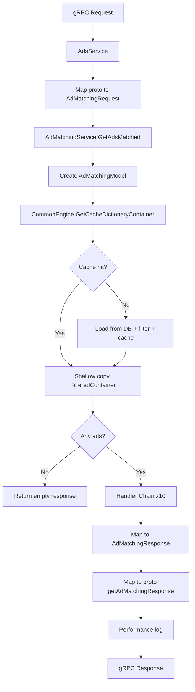
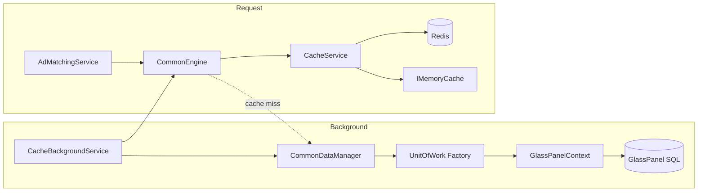
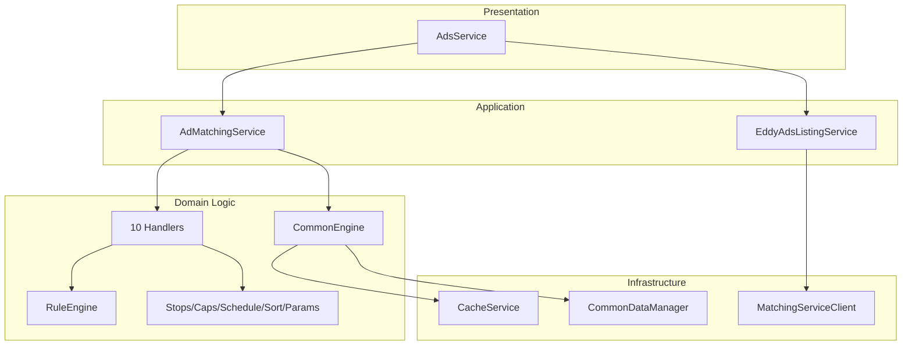
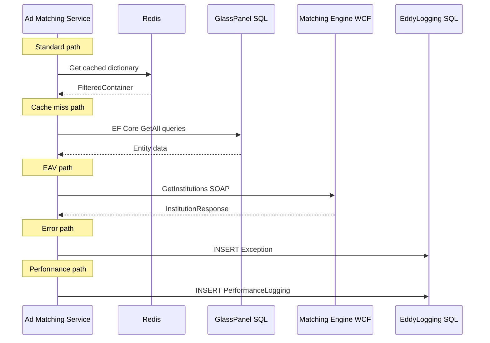
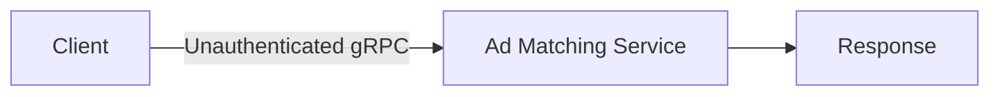
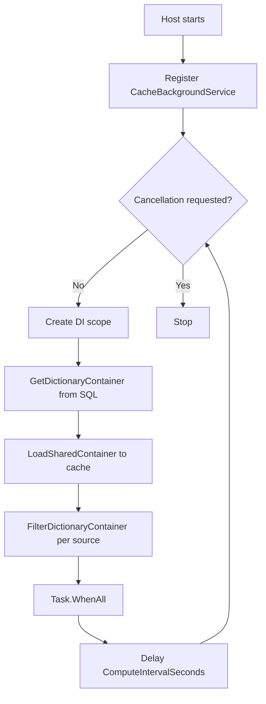
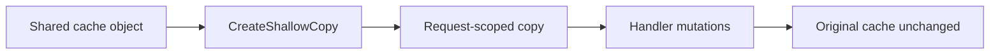

# Data Flow Documentation

## Request Lifecycle (Standard Ad Match)

## Database Interaction Flow

**Key insight:** Normal requests do NOT hit SQL Server. DB accessed only on cache miss or background refresh.

## Service Interaction Flow

## External API Interaction Flow

## Authentication Flow

**Not implemented.** No authentication flow exists.

**(Inferred)** Authentication may occur at network/reverse-proxy level outside this application.

## Background Processing Flow

See [BusinessProcesses.md](./BusinessProcesses.md) Process 13.

## Cache Key Flow

| Key Pattern | Content | Scope |
|-------------|---------|-------|
| `{prefix}:AMS:sharedDictionaryCacheKey` | Ads, slim ads, relationships, timezones | Global |
| `{prefix}:AMS:filteredDictionaryCacheKey:ForSourceId{N}` | Source-filtered campaigns, rules, stops | Per source |

Prefix from `Redis:CachePrefix` (default: `ams-refactor`).

## Mutation Isolation Flow

Evidence: `DictionaryContainer.CreateShallowCopy` in Domain/BusinessEntities.
