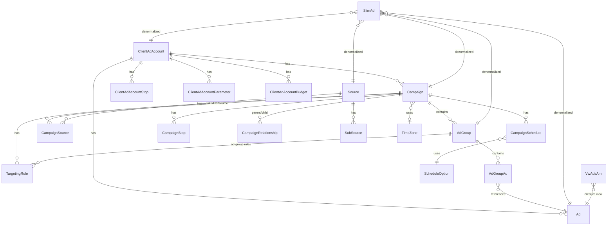

# Database Documentation

## Overview

| Property | Value |
|----------|-------|
| Database | `GlassPanel` on SQL Server |
| Schema | Primarily `AdServer`; `Common` for StateTimeZone |
| Access | EF Core 6.0, read-only (NoTracking) |
| Migrations | **None** — database-first, schema managed externally |
| Stored Procedures | **None referenced in code** (high confidence) |
| Soft Delete | `IsDeleted` flag on many entities; queries filter `!IsDeleted` |
| Audit Fields | `CreatedBy`, `CreatedDate`, `ModifiedBy`, `ModifiedDate` on many entities (inferred from entity patterns) |

Secondary database: **`EddyLogging`** — NLog exception and performance tables only.

## DbContext

Single context: **`GlassPanelContext`** (`EDDY.IS.AdMatching.Data/Context/GlassPanelContext.cs`)

- 93 `DbSet<>` properties
- `QueryTrackingBehavior.NoTracking` in constructor (line 7-13)
- ~1900 lines fluent configuration in `OnModelCreating`

See [DbContext.md](./DbContext.md) for DbSet inventory.

## Entity Relationship Diagram



**Note:** Relationships on `Campaign`, `Ad`, etc. are inferred from FK columns and fluent API. Many entities have FK scalar columns without navigation properties.

## Key Views for Ad Matching

| View | Entity | Purpose |
|------|--------|---------|
| VW_SlimAdsAMS | SlimAd | Pre-joined ad rows for matching (SourceId, bids) |
| VW_AdsAMS | VwAdsAm | Full ad creative for response building |
| VW_CampaignAMS | Campaign | Campaign data (mapped as entity, not table) |
| VW_SourceByCampaignAms | VwSourceByCampaignAms | Source→campaign mapping for pre-filter |
| VW_Rules_* | VwRules* (18 views) | Lookup values for rule engine UI/validation |

## Indexes & Constraints

**Not available in codebase.** EF fluent config defines FK constraint names (e.g., `FK_CampaignSchedule_ScheduleOption`) but index definitions are in SQL Server, not in this repo.

**(Inferred):** Views likely have indexes on underlying tables; `VW_SlimAdsAMS` probably indexed on `SourceId` given query pattern.

## Migration History

No EF migrations folder exists. Schema evolution is **(inferred)** managed via DBA scripts outside this repository.

## Soft Delete Strategy

Pattern observed in `CommonDataManager`:

```csharp
.GetAll(x => x.IsEnabled && !x.IsDeleted)
```

Applied to: Campaigns, AdGroups, Ads, TargetingRules, Schedules, Stops, etc.

Entities without soft delete flag use `IsEnabled` only (e.g., `ScheduleOption`).

## Audit Fields

Present on entities like `AdImage`, `ConversionPixel`, `LineItem` — standard pattern:
- `CreatedBy`, `CreatedDate`, `ModifiedBy`, `ModifiedDate`

AMS runtime does not write audit fields (read-only context).

## NLog Tables (EddyLogging DB)

| Table | Purpose |
|-------|---------|
| dbo.Exception | Error logging |
| dbo.PerformanceLoggingMasterAMS | Request-level performance |
| dbo.PerformanceLoggingDetailAMS | Detailed performance steps |

## Data Loading Pattern

`CommonDataManager.GetDictionaryContainer()` loads entire enabled datasets into in-memory dictionaries — **not lazy loaded per request**.

This is a **full-table-scan architecture** mitigated by:
1. Background refresh every 60s
2. Redis distributed cache
3. In-memory cache layer

## Entities Not in DbContext

| Entity | Status |
|--------|--------|
| AdHistoric | Class exists, no DbSet |
| AdImage, AdImageHistoric, AdImageSizeType | Not registered |
| CampaignDestinationUrl | Not registered |
| VwStandardReport | Not registered |

These may be legacy/scaffold artifacts.
