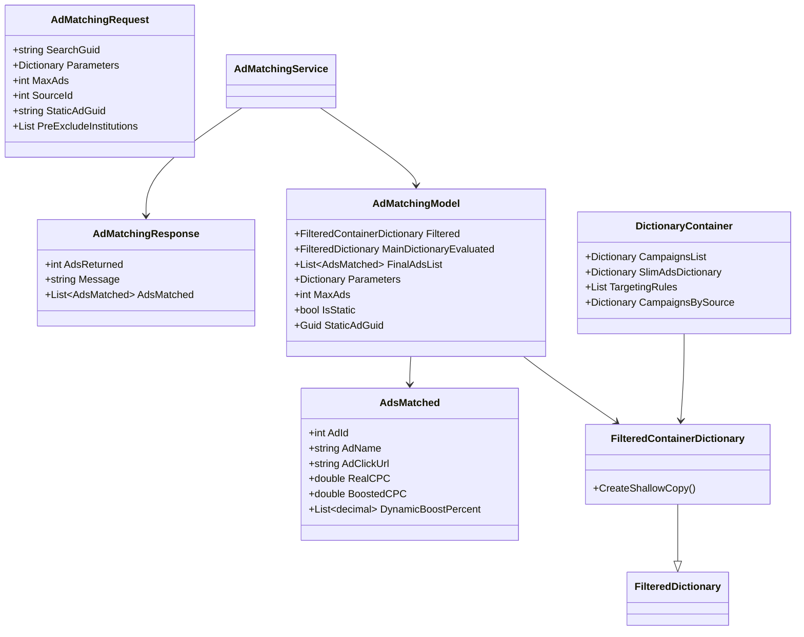
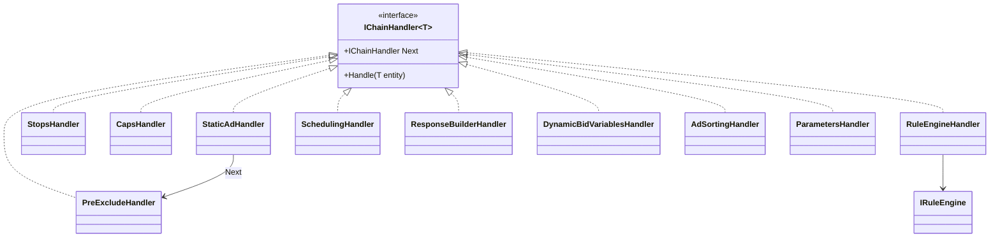
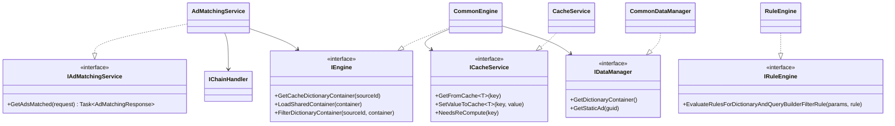
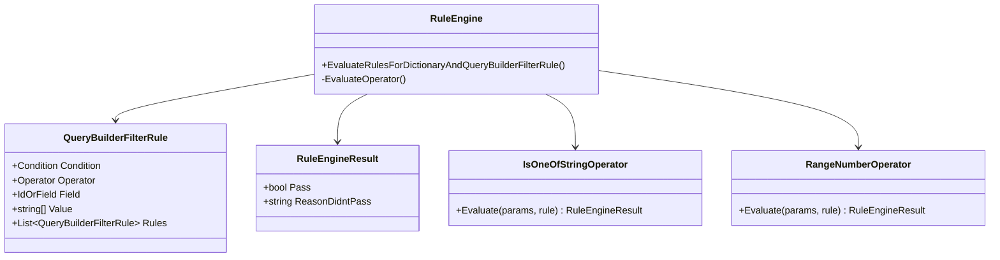
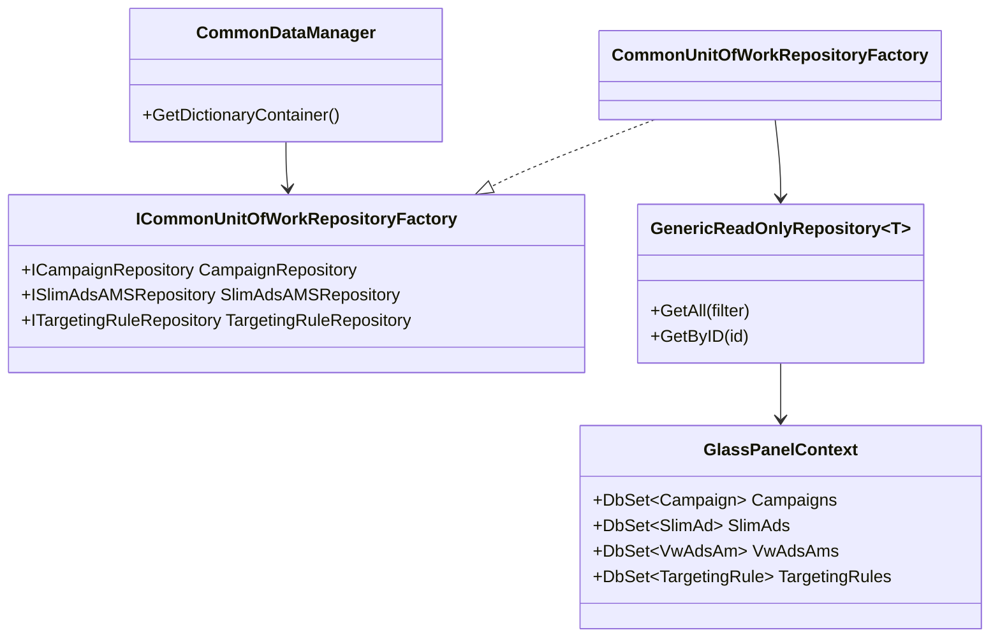
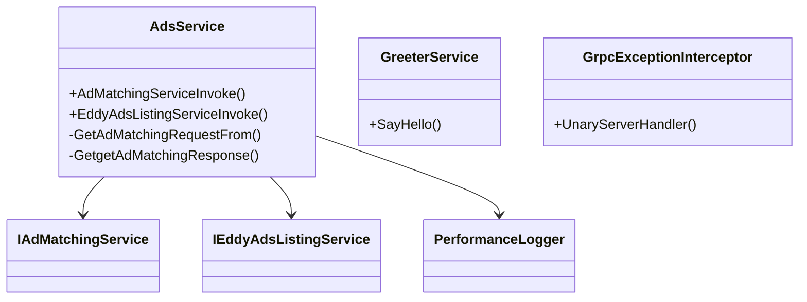
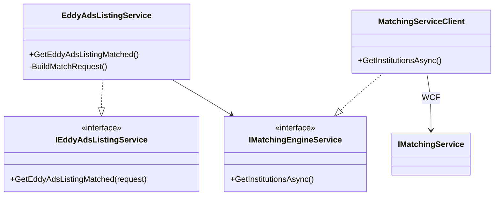

# Class Diagrams

## Core Domain Model

```mermaid
classDiagram
    class AdMatchingRequest {
        +string SearchGuid
        +Dictionary Parameters
        +int MaxAds
        +int SourceId
        +string StaticAdGuid
        +List PreExcludeInstitutions
    }

    class AdMatchingResponse {
        +int AdsReturned
        +string Message
        +List~AdsMatched~ AdsMatched
    }

    class AdMatchingModel {
        +FilteredContainerDictionary Filtered
        +FilteredDictionary MainDictionaryEvaluated
        +List~AdsMatched~ FinalAdsList
        +Dictionary Parameters
        +int MaxAds
        +bool IsStatic
        +Guid StaticAdGuid
    }

    class AdsMatched {
        +int AdId
        +string AdName
        +string AdClickUrl
        +double RealCPC
        +double BoostedCPC
        +List~decimal~ DynamicBoostPercent
    }

    class DictionaryContainer {
        +Dictionary CampaignsList
        +Dictionary SlimAdsDictionary
        +List TargetingRules
        +Dictionary CampaignsBySource
    }

    class FilteredContainerDictionary {
        +CreateShallowCopy()
    }

    AdMatchingService --> AdMatchingModel
    AdMatchingService --> AdMatchingResponse
    AdMatchingModel --> FilteredContainerDictionary
    FilteredContainerDictionary --|> FilteredDictionary
    DictionaryContainer --> FilteredContainerDictionary
    AdMatchingModel --> AdsMatched
```

## Handler Chain

```mermaid
classDiagram
    class IChainHandler~T~ {
        <<interface>>
        +Handle(T entity)
        +IChainHandler Next
    }

    class StaticAdHandler
    class PreExcludeHandler
    class StopsHandler
    class CapsHandler
    class RuleEngineHandler
    class SchedulingHandler
    class ResponseBuilderHandler
    class DynamicBidVariablesHandler
    class AdSortingHandler
    class ParametersHandler

    IChainHandler~AdMatchingModel~ <|.. StaticAdHandler
    IChainHandler~AdMatchingModel~ <|.. PreExcludeHandler
    IChainHandler~AdMatchingModel~ <|.. StopsHandler
    IChainHandler~AdMatchingModel~ <|.. CapsHandler
    IChainHandler~AdMatchingModel~ <|.. RuleEngineHandler
    IChainHandler~AdMatchingModel~ <|.. SchedulingHandler
    IChainHandler~AdMatchingModel~ <|.. ResponseBuilderHandler
    IChainHandler~AdMatchingModel~ <|.. DynamicBidVariablesHandler
    IChainHandler~AdMatchingModel~ <|.. AdSortingHandler
    IChainHandler~AdMatchingModel~ <|.. ParametersHandler

    StaticAdHandler --> PreExcludeHandler : Next
    RuleEngineHandler --> IRuleEngine
```

## Service Layer

```mermaid
classDiagram
    class IAdMatchingService {
        <<interface>>
        +GetAdsMatched(request) Task~AdMatchingResponse~
    }

    class IEngine {
        <<interface>>
        +GetCacheDictionaryContainer(sourceId)
        +LoadSharedContainer(container)
        +FilterDictionaryContainer(sourceId, container)
    }

    class IDataManager {
        <<interface>>
        +GetDictionaryContainer()
        +GetStaticAd(guid)
    }

    class ICacheService {
        <<interface>>
        +GetFromCache~T~(key)
        +SetValueToCache~T~(key, value)
        +NeedsReCompute(key)
    }

    class IRuleEngine {
        <<interface>>
        +EvaluateRulesForDictionaryAndQueryBuilderFilterRule(params, rule)
    }

    AdMatchingService ..|> IAdMatchingService
    CommonEngine ..|> IEngine
    CommonDataManager ..|> IDataManager
    CacheService ..|> ICacheService
    RuleEngine ..|> IRuleEngine

    AdMatchingService --> IEngine
    AdMatchingService --> IChainHandler
    CommonEngine --> ICacheService
    CommonEngine --> IDataManager
```

## Rule Engine

```mermaid
classDiagram
    class RuleEngine {
        +EvaluateRulesForDictionaryAndQueryBuilderFilterRule()
        -EvaluateOperator()
    }

    class QueryBuilderFilterRule {
        +Condition Condition
        +Operator Operator
        +IdOrField Field
        +string[] Value
        +List~QueryBuilderFilterRule~ Rules
    }

    class RuleEngineResult {
        +bool Pass
        +string ReasonDidntPass
    }

    class IsOneOfStringOperator {
        +Evaluate(params, rule) RuleEngineResult
    }

    class RangeNumberOperator {
        +Evaluate(params, rule) RuleEngineResult
    }

    RuleEngine --> QueryBuilderFilterRule
    RuleEngine --> RuleEngineResult
    RuleEngine --> IsOneOfStringOperator
    RuleEngine --> RangeNumberOperator
```

## Data Access Layer

```mermaid
classDiagram
    class GlassPanelContext {
        +DbSet~Campaign~ Campaigns
        +DbSet~SlimAd~ SlimAds
        +DbSet~VwAdsAm~ VwAdsAms
        +DbSet~TargetingRule~ TargetingRules
    }

    class ICommonUnitOfWorkRepositoryFactory {
        +ICampaignRepository CampaignRepository
        +ISlimAdsAMSRepository SlimAdsAMSRepository
        +ITargetingRuleRepository TargetingRuleRepository
    }

    class GenericReadOnlyRepository~T~ {
        +GetAll(filter)
        +GetByID(id)
    }

    class CommonDataManager {
        +GetDictionaryContainer()
    }

    CommonUnitOfWorkRepositoryFactory ..|> ICommonUnitOfWorkRepositoryFactory
    GenericReadOnlyRepository~T~ --> GlassPanelContext
    CommonUnitOfWorkRepositoryFactory --> GenericReadOnlyRepository~T~
    CommonDataManager --> ICommonUnitOfWorkRepositoryFactory
```

## gRPC Layer

```mermaid
classDiagram
    class AdsService {
        +AdMatchingServiceInvoke()
        +EddyAdsListingServiceInvoke()
        -GetAdMatchingRequestFrom()
        -GetgetAdMatchingResponse()
    }

    class GreeterService {
        +SayHello()
    }

    class GrpcExceptionInterceptor {
        +UnaryServerHandler()
    }

    AdsService --> IAdMatchingService
    AdsService --> IEddyAdsListingService
    AdsService --> PerformanceLogger
```

## EAV Integration

```mermaid
classDiagram
    class IEddyAdsListingService {
        <<interface>>
        +GetEddyAdsListingMatched(request)
    }

    class EddyAdsListingService {
        +GetEddyAdsListingMatched()
        -BuildMatchRequest()
    }

    class IMatchingEngineService {
        <<interface>>
        +GetInstitutionsAsync()
    }

    class MatchingServiceClient {
        +GetInstitutionsAsync()
    }

    EddyAdsListingService ..|> IEddyAdsListingService
    MatchingServiceClient ..|> IMatchingEngineService
    EddyAdsListingService --> IMatchingEngineService
    MatchingServiceClient --> IMatchingService : WCF
```
