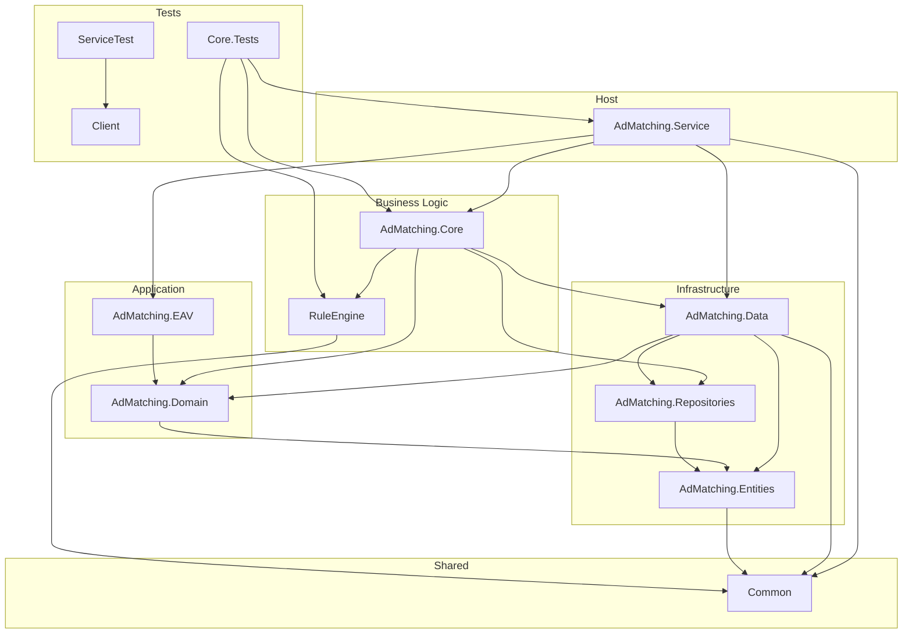
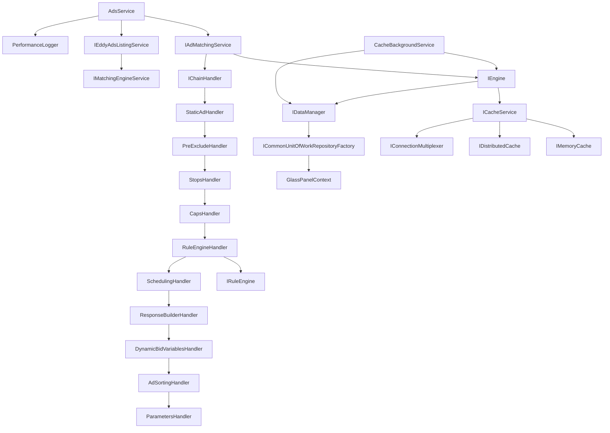
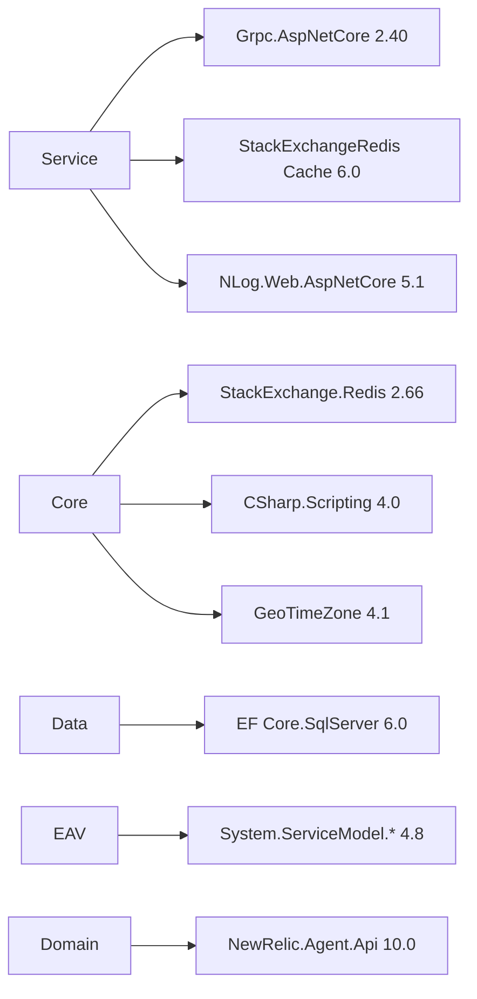
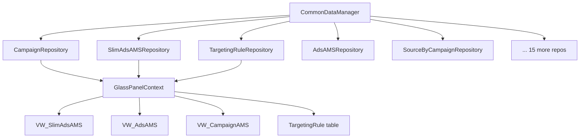
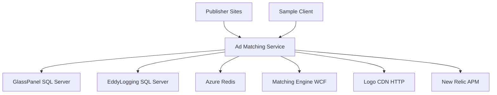

# Dependency Graphs

## Project Dependency Graph

## DI Dependency Graph (Runtime)

## NuGet Package Dependency Graph (Key Packages)

## Data Dependency Graph

## External System Dependency Graph

