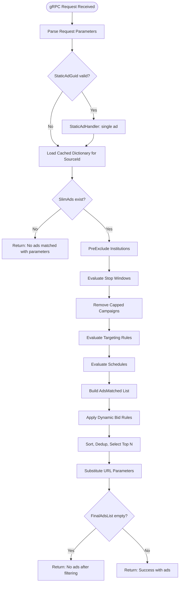
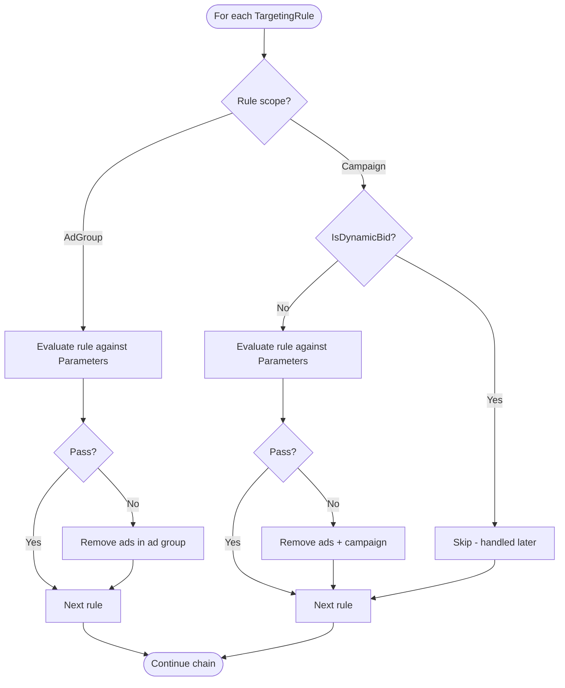
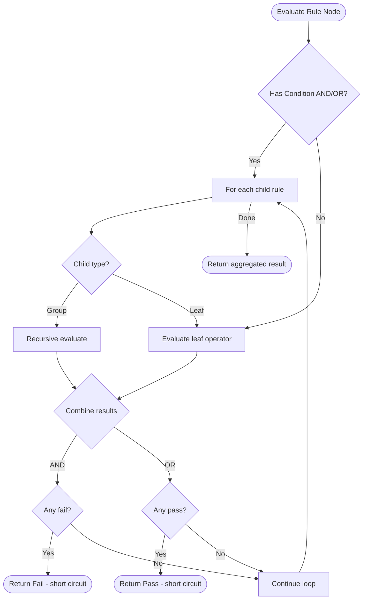
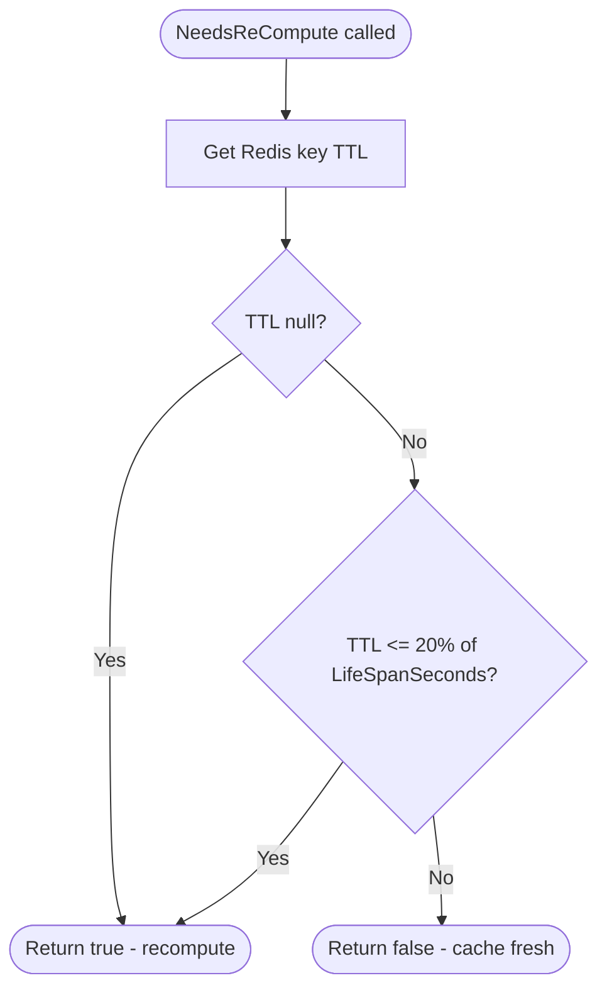
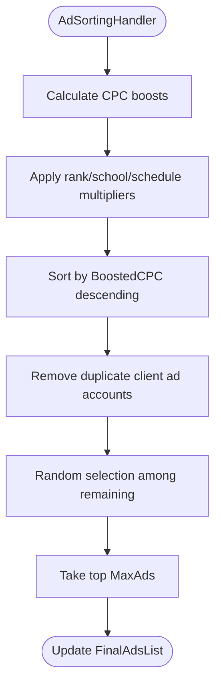
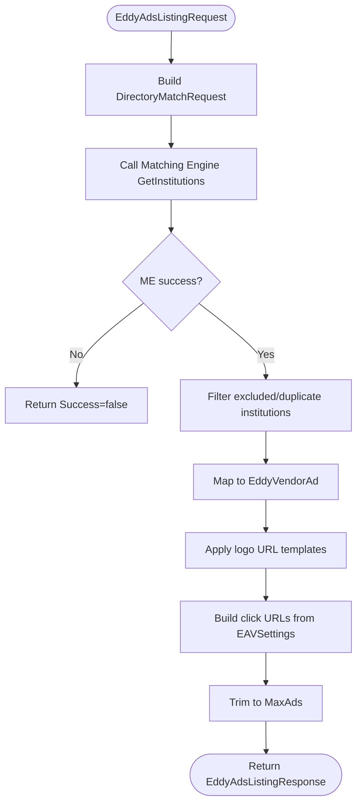
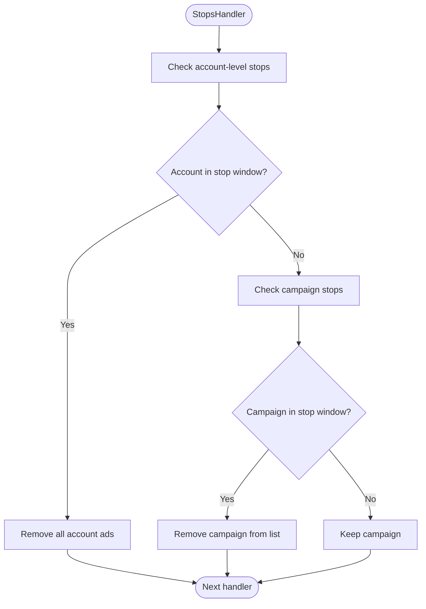
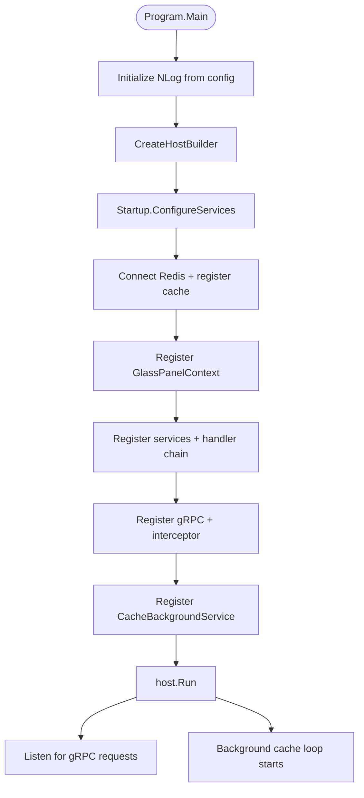

# Flowcharts

## 1. Ad Matching Decision Flow

## 2. Targeting Rule Evaluation

## 3. Rule Engine Tree Evaluation

## 4. Cache TTL Recompute Decision

## 5. Ad Sorting & Selection

## 6. EAV Listing Flow

## 7. Stop Window Evaluation

## 8. Startup & Configuration Flow

