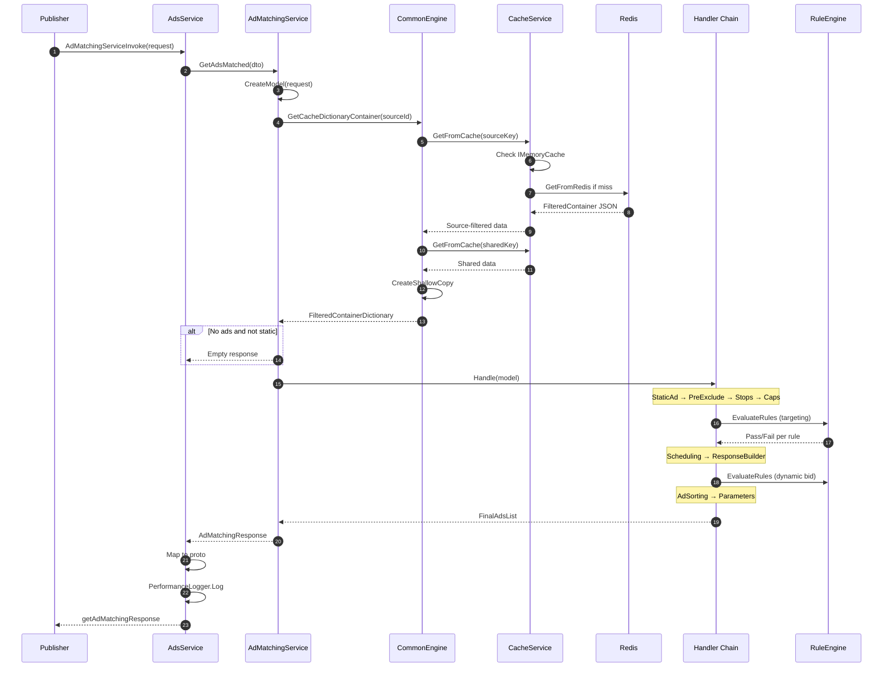
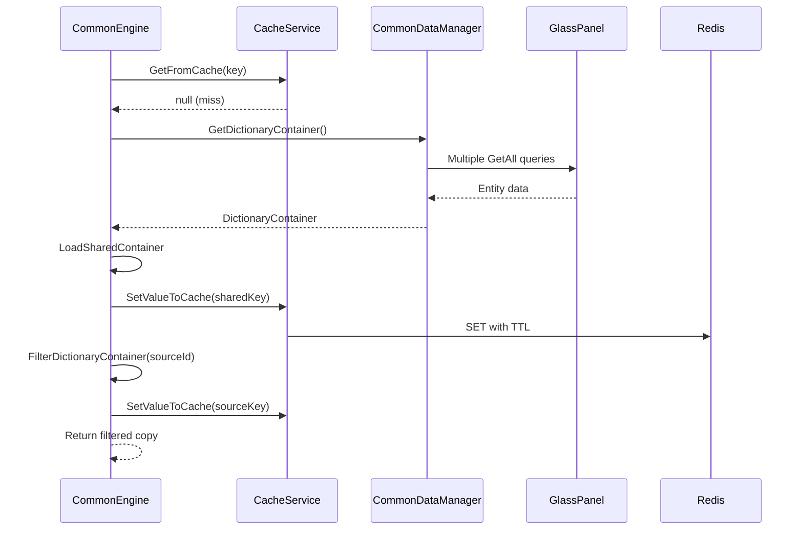
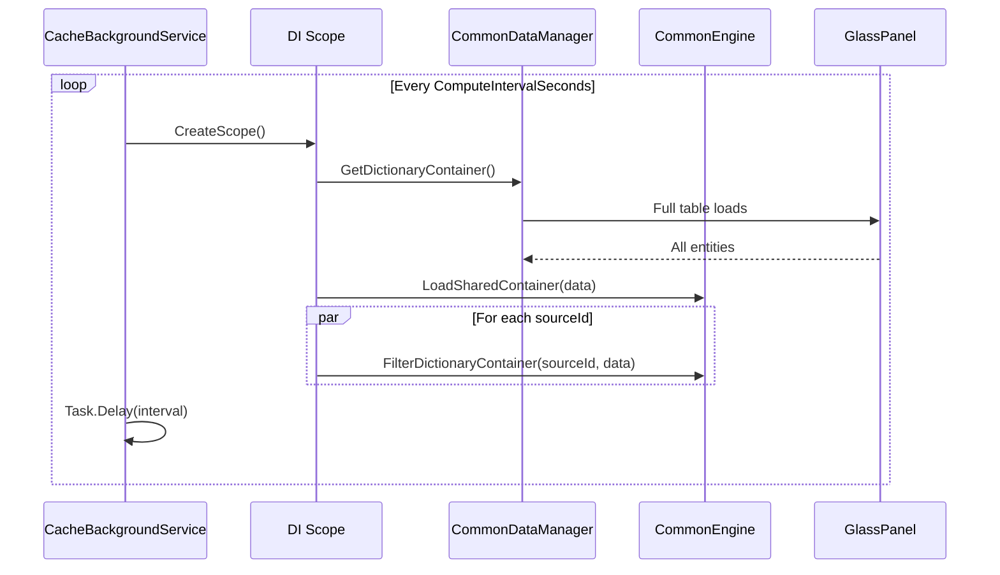
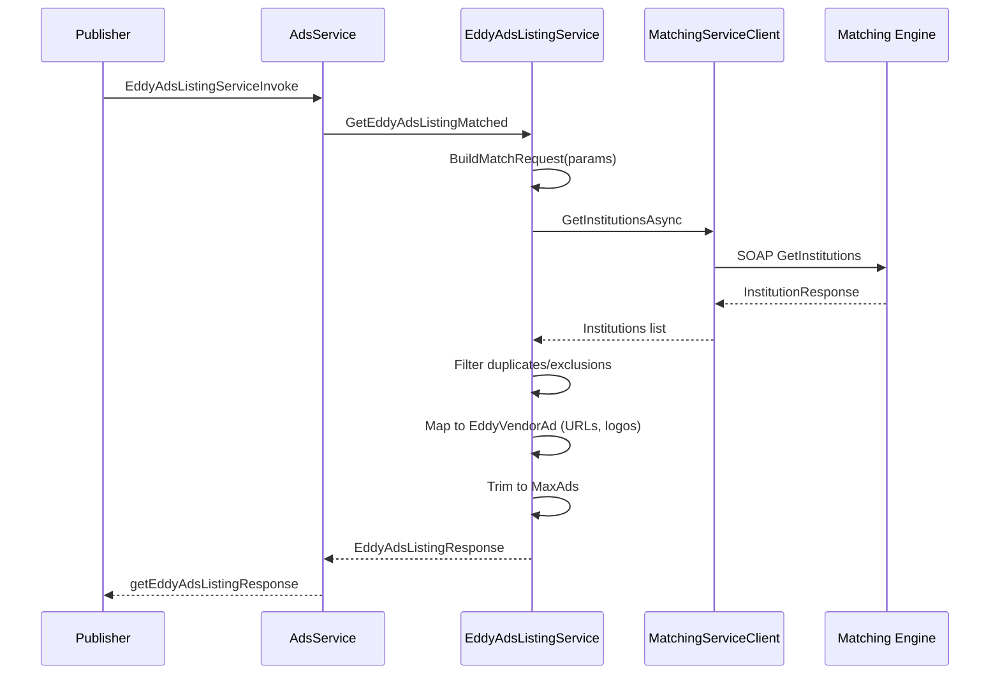
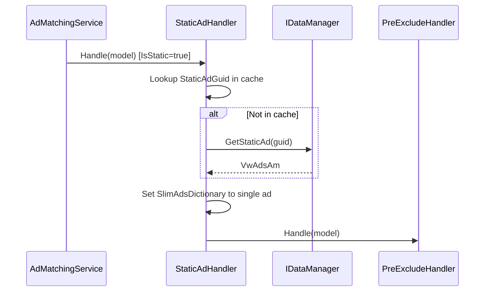
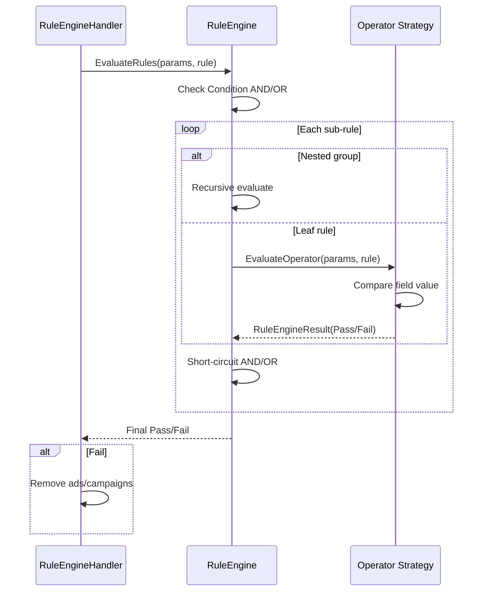
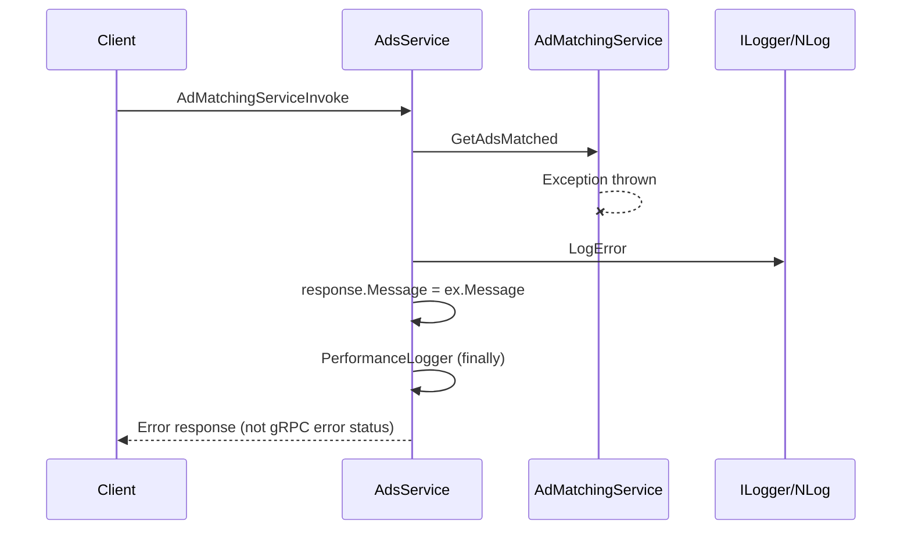
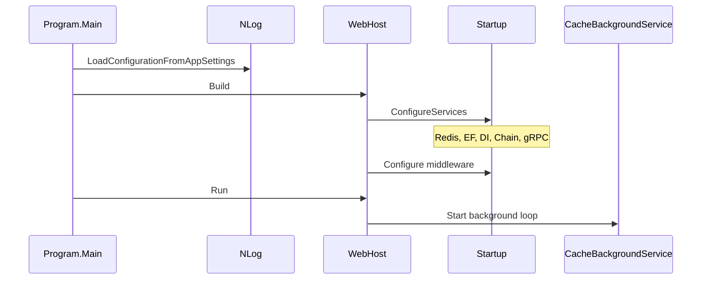

# Sequence Diagrams

## 1. Standard Ad Matching (Full)

## 2. Cache Miss Recovery

## 3. Background Cache Refresh

## 4. Eddy Ads Listing (EAV)

## 5. Static Ad Path

## 6. Rule Engine Evaluation

## 7. Error Handling Flow

## 8. Application Startup

