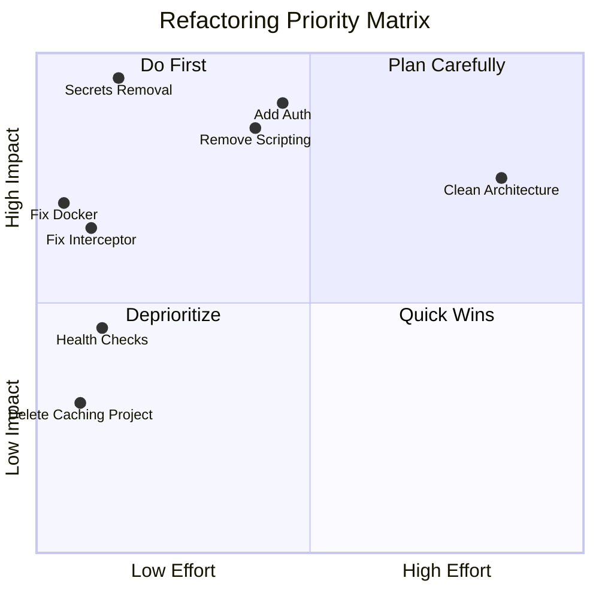

# Refactoring Recommendations

Ranked by business and technical impact.

---

## P0 — Critical

### 1. Remove Secrets from Source Control

| Aspect | Detail |
|--------|--------|
| Problem | Redis password and SQL connection strings in committed appsettings.json |
| Risk | Credential exposure, compliance violation |
| Effort | Small — move to User Secrets / Key Vault / env vars |
| Business Impact | Prevents security breach |
| Technical Impact | Enables safe public repo / CI |
| Implementation | Azure Key Vault provider; `.gitignore` appsettings secrets; template file |

### 2. Add Authentication to gRPC Endpoints

| Aspect | Detail |
|--------|--------|
| Problem | Open gRPC endpoints with no auth |
| Risk | Unauthorized ad serving, DoS, data scraping |
| Effort | Medium — mTLS or API key interceptor |
| Business Impact | Protects revenue-generating ad inventory |
| Technical Impact | Standard security posture |
| Implementation | gRPC interceptor validating API key header or client certificate |

---

## P1 — High

### 3. Fix Docker/Runtime Version Mismatch

| Problem | Dockerfile uses .NET 5.0, project is net6.0 |
| Effort | Trivial — update base images |
| Implementation | Change to `mcr.microsoft.com/dotnet/aspnet:6.0` and `sdk:6.0` |

### 4. Replace C# Scripting in ParametersEvaluator

| Problem | Roslyn script execution on URL parameters |
| Risk | Remote code execution if rule data compromised |
| Effort | Medium — whitelist macro engine |
| Implementation | Replace `CSharpScript.EvaluateAsync` with predefined function library |

### 5. Fix GrpcExceptionInterceptor Null Return

| Problem | Returns null instead of RpcException |
| Risk | Client confusion, silent failures |
| Effort | Small |
| Implementation | `throw new RpcException(new Status(StatusCode.Internal, "..."))` |

### 6. Implement or Remove Unimplemented Proto RPCs

| Problem | AdStaticMatchingServiceInvoke, CatalogGreet defined but not implemented |
| Effort | Small (remove) or Medium (implement) |
| Implementation | Either add overrides or remove from proto with version bump |

---

## P2 — Medium

### 7. Delete Dead Caching Project

| Problem | Empty EDDY.IS.AdMatching.Caching confuses ownership |
| Effort | Small |
| Implementation | Remove project; document CacheService in Core as canonical |

### 8. Remove Legacy Excluded Code

| Problem | RulesEvaluator.cs, DataManager.cs, CoreException.cs compiled out but present |
| Effort | Small |
| Implementation | Delete files or move to archive branch |

### 9. Add CI/CD Pipeline

| Problem | No automated build/test/deploy |
| Effort | Medium |
| Implementation | GitHub Actions or Azure DevOps: build, test, vulnerability scan, deploy |

### 10. Consolidate Test Frameworks

| Problem | MSTest in Core.Tests, NUnit in Service csproj and ServiceTest |
| Effort | Medium |
| Implementation | Standardize on xUnit or MSTest across all test projects |

### 11. Parallelize CommonDataManager Loads

| Problem | ~20 sequential full-table queries on cache refresh |
| Effort | Medium |
| Implementation | `Task.WhenAll` for independent repository loads |

### 12. Add Health Checks

| Problem | No liveness/readiness probes |
| Effort | Small |
| Implementation | `AddHealthChecks().AddRedis().AddSqlServer()` + `/health` endpoint |

---

## P3 — Low

### 13. Migrate to Minimal Hosting Model

| Problem | Legacy Startup.cs pattern |
| Effort | Medium |
| Implementation | Consolidate Program.cs + Startup into top-level statements |

### 14. Introduce Clean Architecture Boundaries

| Problem | Core depends on Data; Domain depends on Entities |
| Effort | Large |
| Implementation | Extract interfaces to Domain; move EF to Infrastructure; use domain models |

### 15. Add EF Core Migrations or Document Schema Process

| Problem | No migration history; schema changes opaque |
| Effort | Medium-Large |
| Implementation | Scaffold workflow documentation or adopt migrations for AMS-specific views |

### 16. Map All Proto Fields to Domain DTO

| Problem | PlacementGuid, SessionGuid, Channel not mapped |
| Effort | Small |
| Implementation | Extend AdMatchingRequest or document intentional omission |

### 17. Implement Equal Operator in RuleEngine

| Problem | `Operator.Equal` enum defined but not dispatched |
| Effort | Small |
| Implementation | Add EqualStringOperator and wire in EvaluateOperator |

### 18. Update NuGet Packages

| Problem | EF Core 6.0.0, Grpc 2.40.0 may have patches |
| Effort | Small-Medium |
| Implementation | Update and regression test |

---

## Impact Matrix

