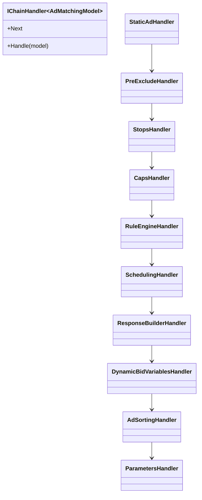

# Handler Chain Documentation

Registered in `Startup.cs:73-84`. Each handler implements `IChainHandler<AdMatchingModel>` with `Handle` method and `Next` pointer.

## Chain Order & Responsibilities

### 1. StaticAdHandler

| Aspect | Detail |
|--------|--------|
| Purpose | Handle single-ad static placements |
| Input | `IsStatic`, `StaticAdGuid` |
| Mutates | `StaticAds`, `MainDictionaryEvaluated.SlimAdsDictionary` |
| Collaborators | `IDataManager.GetStaticAd` |
| Skip condition | `IsStatic == false` |

### 2. PreExcludeHandler

| Aspect | Detail |
|--------|--------|
| Purpose | Remove excluded institution accounts |
| Input | `PreExcludeInstitutions` |
| Mutates | Removes accounts/ads from evaluated dictionaries |
| Rule | Match `ClientAdAccount.InstitutionAlias` |

### 3. StopsHandler

| Aspect | Detail |
|--------|--------|
| Purpose | Enforce account/campaign stop windows |
| Collaborators | `StopsEvaluator`, `CommonTimeZoneManager` |
| Mutates | `MainDictionaryEvaluated.CampaignsList` |
| Failure | Campaign removed during active stop |

### 4. CapsHandler

| Aspect | Detail |
|--------|--------|
| Purpose | Remove capped campaigns |
| Collaborators | `CapsEvaluator` |
| Rule | Respects parent campaign cap via `CampaignRelationship` |

### 5. RuleEngineHandler

| Aspect | Detail |
|--------|--------|
| Purpose | Targeting/optimization rule filtering |
| Collaborators | `IRuleEngine` (singleton) |
| Scope | Ad-group rules, campaign rules (non-dynamic-bid) |
| On failure | Remove ads and/or campaigns from evaluated dict |

### 6. SchedulingHandler

| Aspect | Detail |
|--------|--------|
| Purpose | Schedule window evaluation |
| Collaborators | `ScheduleEvaluator` |
| On inactive + DisableAds | Remove campaign |
| On active | Attach schedule for bid boost |

### 7. ResponseBuilderHandler

| Aspect | Detail |
|--------|--------|
| Purpose | Build `FinalAdsList` from surviving ads |
| Collaborators | `ResponseBuilder` |
| Output | List of `AdsMatched` domain objects |

### 8. DynamicBidVariablesHandler

| Aspect | Detail |
|--------|--------|
| Purpose | Apply dynamic bid percentage boosts |
| Collaborators | `IRuleEngine` |
| Scope | `IsDynamicBid` rules only, post-response-build |
| On pass | Append to `AdsMatched.DynamicBoostPercent` |

### 9. AdSortingHandler

| Aspect | Detail |
|--------|--------|
| Purpose | CPC ranking, dedup, random top-N |
| Collaborators | `AdSortingEngine` |
| Input | `MaxAds` |
| Rules | Account dedup, multiplier application |

### 10. ParametersHandler (Terminal)

| Aspect | Detail |
|--------|--------|
| Purpose | URL/name/description macro substitution |
| Collaborators | `ParametersEvaluator` |
| Next | `null` |
| Features | Rolling dates, C# script dynamic params |

## Chain Wiring

**DI mechanism:** `ChainConfigurator` compiles expression trees linking constructor-injected `Next` handlers (`Core/ChainResponsability/ChainConfigurator.cs`).

## AdMatchingModel State Flow

| Stage | Key Fields Populated |
|-------|---------------------|
| After CreateModel | Parameters, MaxAds, SourceId, IsStatic |
| After Engine load | Filtered (cached dictionary) |
| After StaticAd | MainDictionaryEvaluated.SlimAdsDictionary |
| After Stops/Caps/Rules | MainDictionaryEvaluated.CampaignsList trimmed |
| After ResponseBuilder | FinalAdsList |
| After DynamicBid | FinalAdsList.DynamicBoostPercent |
| After AdSorting | FinalAdsList reordered/truncated |
| After Parameters | FinalAdsList URLs substituted |

## Thread Safety

- Handlers are **scoped per request** — no shared mutable state between requests
- `IRuleEngine` is **singleton** but appears stateless (operators instantiated per evaluation)
- `AdMatchingModel` is mutated sequentially through chain — not thread-safe, single-threaded per request

## Test Coverage

Each handler has corresponding tests in `EDDY.IS.AdMatching.Core.Tests/RequestHandlerTests/`.
